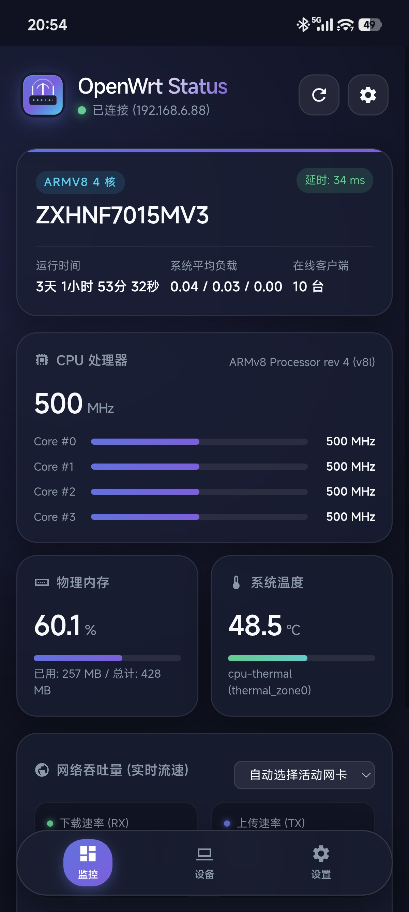
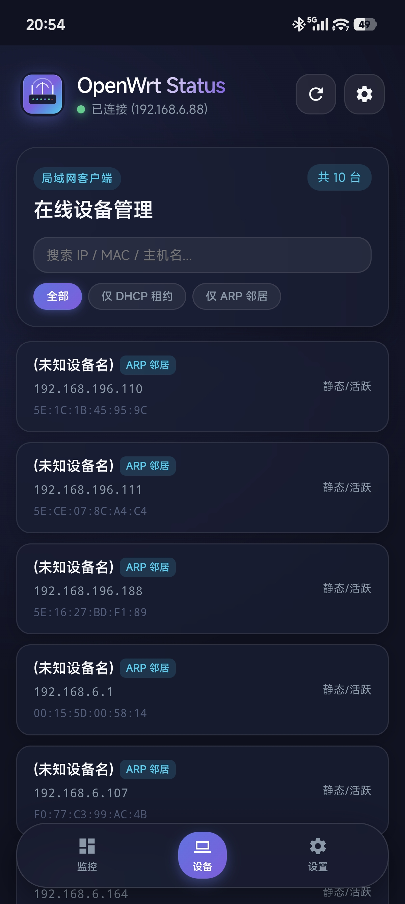

# OpenWrt Status Backend Service (Rust Edition)

专为 OpenWrt 路由器打造的极致轻量、高性能系统状态监控后端服务。使用 **Rust** 语言编写，具备**零运行时开销（无 GC）**、**超低内存占用（仅 1~3MB）** 与**极小二进制体积**等特点，针对主流 **x86 与 ARM** 平台提供纯静态 musl 预编译包。

---

## 特性亮点

- ⚡ **极致轻量**：基于 Rust 2021 + Tokio + Axum，常驻内存仅需 **1MB ~ 3MB**，CPU 开销几乎为 0，对路由器硬件零负担。
- 🌡️ **全面指标采集**：
  - **CPU 频率**：支持动态读取 `/sys/devices/system/cpu/cpufreq` 与 `/proc/cpuinfo` 降级兜底。
  - **系统温度**：自动扫描并读取 `thermal_zone` 及 `hwmon` 传感器摄氏度（CPU / SoC / 外围传感器）。
  - **连接客户端**：解析 dnsmasq 租约 (`/tmp/dhcp.leases`) 与 ARP 邻居表 (`/proc/net/arp`)，统计在线客户端数量并输出 IP、MAC 及主机名列表。
  - **网络吞吐量与时间**：Tokio 后台定时采样 `/proc/net/dev`，精确计算每个网络接口（WAN / LAN / WLAN）的毫秒时间戳与实时吞吐量（Bytes/s、KB/s、Mbps）。
  - **系统概览**：包含主机名、系统运行时间 (Uptime)、系统负载 (1/5/15) 及物理内存占用。
- 📱 **配套移动端 App**：提供 Argon 现代化磨砂玻璃主题风格的 Web / Android APK 应用，支持自定义主机/端口连接，监控仪表盘与在线设备管理独立展示。
- 🌐 **开箱即用**：自带全量 CORS 跨域支持，支持与任意 Web 前端、Vue/React 单页应用或 Home Assistant 等无缝对接。
- 🔒 **可选安全认证**：支持设置 Token 鉴权（通过命令行参数 `-t / --token` 或环境变量 `STATUS_TOKEN` 控制）。
- 🚀 **自动化流水线**：集成 GitHub Actions，覆盖 `x86_64`、`i686`、`aarch64`、`armv7` 4 大主流架构的 musl 纯静态编译以及 Android APK 构建发布。

---

## 📱 界面预览 (Argon 风格客户端)

配套提供 Argon 现代化质感主题的移动端 Web 与 Android 客户端，将**监控仪表盘**与**设备列表**独立分屏展示，支持配置路由器 IP/端口测试连通性，支持设备即时搜索与分类筛选：

| 仪表盘监控页 (`main.jpg`) | 在线设备管理页 (`device.jpg`) |
| :-----------------------: | :--------------------------: |
|  |  |

---

## 本地开发与测试 (Windows / Linux / macOS)

由于使用 Rust 编写，您可以直接在本地电脑上进行极速编译与测试：

### 1. 语法检查与编译
```bash
cargo check
cargo build
```

### 2. 本地启动服务
```bash
cargo run -- --port 9090
```

### 3. 使用随附 Python 客户端测试
```bash
# 单次快速全量测试
python test_client.py -u http://127.0.0.1:9090

# 开启实时动态监控仪表盘 (每 2 秒刷新)
python test_client.py -u http://127.0.0.1:9090 --watch
```

---

## API 接口文档

默认监听端口为 `:9090`，基础路径为 `/api/v1`。

### 1. 全量状态聚合接口
- **请求**: `GET /api/v1/status`
- **说明**: 一次性获取系统概览、CPU、温度、客户端及网卡吞吐量等全部数据。
- **响应示例**:
```json
{
  "code": 200,
  "message": "success",
  "data": {
    "system": {
      "hostname": "OpenWrt",
      "current_time": "2026-09-18T09:55:20.010046200Z",
      "uptime_seconds": 128940,
      "uptime_format": "1天 11小时 49分 0秒",
      "load_avg_1": 0.12,
      "load_avg_5": 0.08,
      "load_avg_15": 0.05,
      "total_memory_kb": 1024256,
      "free_memory_kb": 614400,
      "avail_memory_kb": 789120,
      "memory_usage_percent": 22.9
    },
    "cpu": {
      "model_name": "x86_64",
      "cores": 4,
      "avg_frequency_mhz": 2400.0,
      "core_list": [
        { "core_id": 0, "frequency_mhz": 2400.0 },
        { "core_id": 1, "frequency_mhz": 2400.0 },
        { "core_id": 2, "frequency_mhz": 2400.0 },
        { "core_id": 3, "frequency_mhz": 2400.0 }
      ]
    },
    "thermal": {
      "sensors": [
        { "name": "cpu-thermal (thermal_zone0)", "temperature": 46.5, "type": "thermal_zone" }
      ]
    },
    "clients": {
      "total_clients": 2,
      "clients": [
        {
          "ip_address": "192.168.1.100",
          "mac_address": "aa:bb:cc:11:22:33",
          "hostname": "iPhone",
          "expires_at": "2026-09-18 23:59:59",
          "source": "dhcp"
        },
        {
          "ip_address": "192.168.1.105",
          "mac_address": "dd:ee:ff:44:55:66",
          "hostname": null,
          "expires_at": null,
          "source": "arp"
        }
      ]
    },
    "network": {
      "timestamp": "2026-09-18T09:55:19.320726400Z",
      "interfaces": [
        {
          "interface": "eth0",
          "rx_bytes_per_sec": 154200.0,
          "tx_bytes_per_sec": 32800.0,
          "rx_kbps": 1233.6,
          "tx_kbps": 262.4,
          "rx_mbps": 1.23,
          "tx_mbps": 0.26,
          "rx_total_bytes": 104857600,
          "tx_total_bytes": 52428800,
          "rx_total_packets": 82000,
          "tx_total_packets": 41000,
          "rx_errors": 0,
          "tx_errors": 0,
          "timestamp": "2026-09-18T09:55:19.320726400Z"
        }
      ]
    }
  }
}
```

### 2. 独立功能接口
| 接口 | 方法 | 说明 |
| :--- | :--- | :--- |
| `/api/v1/cpu` | GET | 单独获取 CPU 型号、核心数、各核频率及平均频率 |
| `/api/v1/thermal` | GET | 单独获取系统温度传感器摄氏度列表 |
| `/api/v1/clients` | GET | 单独获取当前连接设备总数与客户端列表（IP、MAC、主机名等） |
| `/api/v1/network` | GET | 单独获取各网卡最新时间戳与实时吞吐速率（Bytes/s、kbps、mbps） |
| `/api/v1/health` | GET | 服务健康检查接口 |

---

## 快速安装与部署 (OpenWrt)

### 1. 下载对应架构二进制
在 GitHub 仓库的 **Releases** 页面下载对应路由器架构的压缩包：

- **x86 软路由 (64位)**: `openwrt-status-x86_64-musl.tar.gz`
- **x86 软路由 (32位)**: `openwrt-status-i686-musl.tar.gz`
- **ARM64 (如 NanoPi R2S/R4S/R5S/R6S、树莓派4/5、RK3568)**: `openwrt-status-aarch64-musl.tar.gz`
- **ARMv7 (如 斐讯K3、华硕、BCM 等)**: `openwrt-status-armv7-musleabihf.tar.gz`
- **安卓客户端 (Android App)**: `openwrt-status-app.apk`

### 2. 上传并安装到 OpenWrt
通过 SSH 或 SCP 将压缩包上传至路由器 `/tmp` 目录并解压：

```sh
cd /tmp
tar -zxvf openwrt-status-*.tar.gz

# 移动二进制文件并赋予执行权限
mv openwrt-status /usr/bin/
chmod +x /usr/bin/openwrt-status

# 安装 procd 服务脚本并赋予执行权限
mv openwrt-status.init /etc/init.d/openwrt-status
chmod +x /etc/init.d/openwrt-status

# 启用开机自启并启动服务
/etc/init.d/openwrt-status enable
/etc/init.d/openwrt-status start
```

---

## 配置参数与自定义选项

服务支持通过命令行参数或环境变量进行配置：

| 命令行参数 | 环境变量 | 默认值 | 说明 |
| :--- | :--- | :--- | :--- |
| `-p`, `--port` | `STATUS_PORT` | `9090` | HTTP 服务监听端口 |
| `--host` | `STATUS_HOST` | `0.0.0.0` | HTTP 服务监听地址 |
| `-i`, `--interval`| `STATUS_INTERVAL`| `1.0` | 网卡吞吐量采样间隔 (秒) |
| `-t`, `--token` | `STATUS_TOKEN` | `""` | 访问 API 所需鉴权 Token（留空则不开启鉴权） |
| `-V`, `--version` | - | - | 查看程序版本 |
